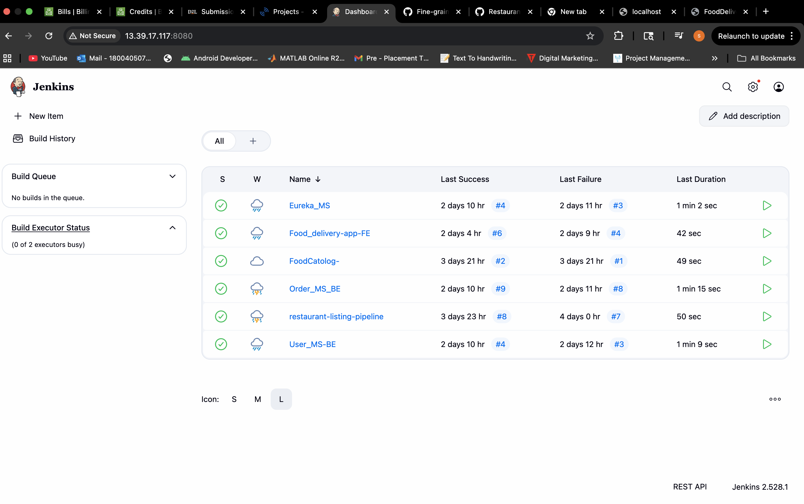
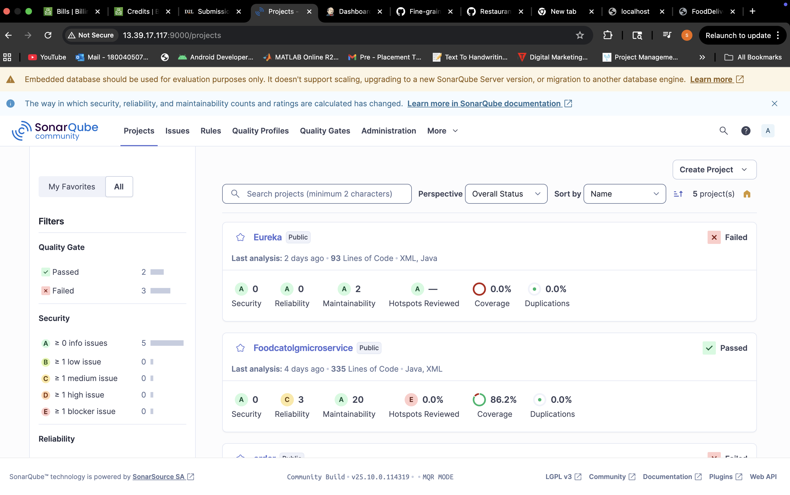
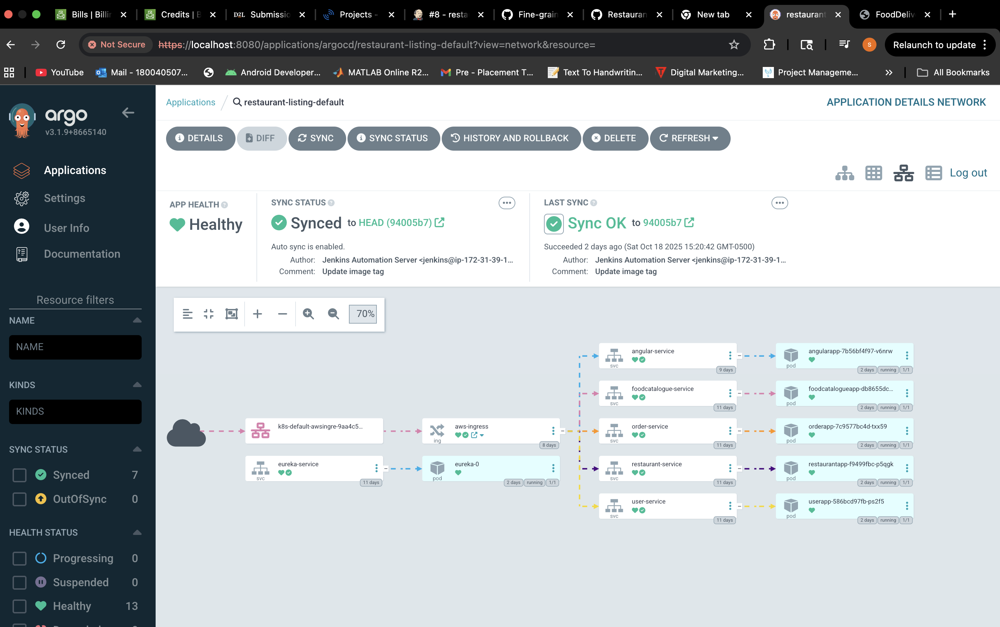
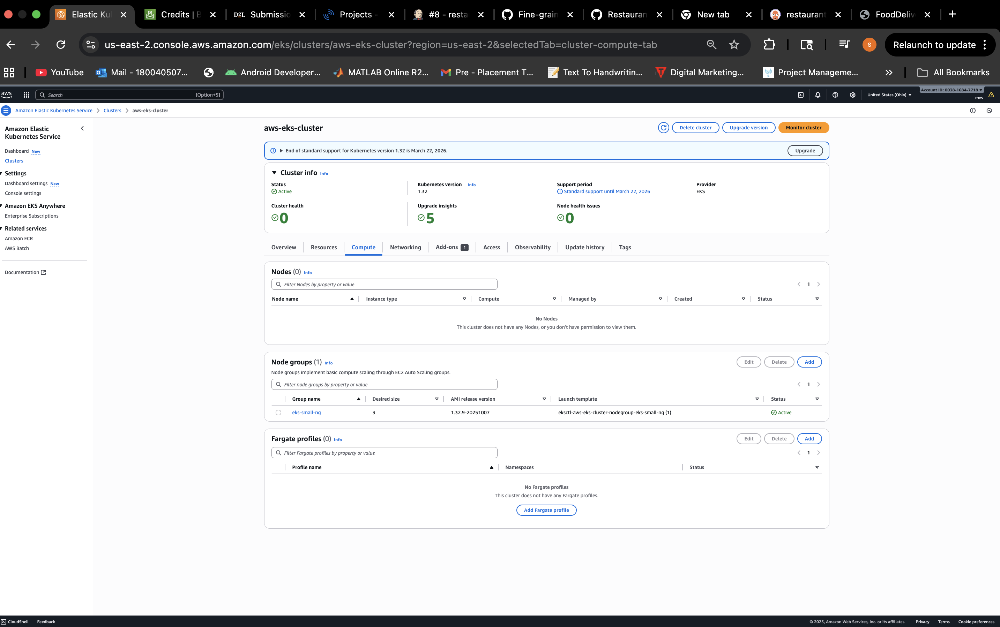
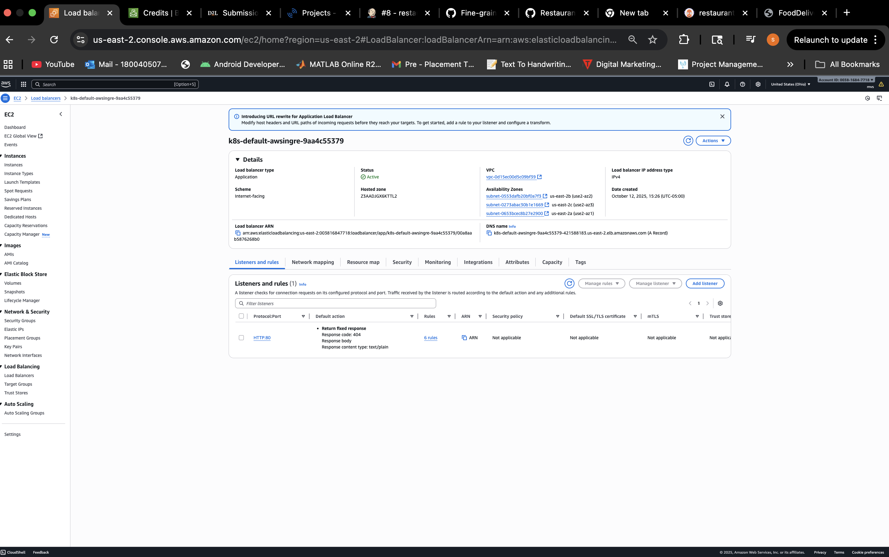

# 🍽️ Food Delivery Microservices Platform

Cloud-native, production-style project that demonstrates a full path from **code → quality → container → Kubernetes on AWS**.  
Built with **Spring Boot**, **Angular**, **AWS EKS**, **RDS (MySQL)**, **MongoDB Atlas**, **Jenkins**, **SonarQube**, **Docker**, and **Argo CD (GitOps)**.

> **Note:** AWS resources are currently **torn down** to avoid charges. This repo documents how to **redeploy on demand** for interviews/demos (see **Redeploy in 7 Steps**).

---

## 🏗️ High-Level Architecture
```
             ┌─────────────────────────────┐
             │        Jenkins + CI/CD      │
             │ (GitHub → Build → Docker)   │
             └────────────┬────────────────┘
                          │
                          ▼
                ┌──────────────────┐
                │   Docker Hub     │
                │   (Images)       │
                └────────┬─────────┘
                         │
                         ▼
    ┌───────────────────────────────────────────────────────┐
    │                       Argo CD                         │
    │ (GitOps: watches deployment-folder & syncs to EKS)    │
    └─────────────────┬─────────────────────────────────────┘
                      │
                      ▼
            ┌───────────────────────┐
            │       AWS EKS         │
            │   Kubernetes Cluster  │
            └─────────┬─────────────┘
                      │
          ┌───────────┼────────────────────┐
          ▼           ▼                    ▼
┌────────────────┐┌────────────────┐┌────────────────┐
│  Angular (FE)   ││ Spring Boot MS ││  Eureka Server │
│   Nginx:80      ││ 9091–9094      ││ 8761           │
└────────────────┘└────────────────┘└────────────────┘
         │                │
         └────Ingress─────┘
                │
                ▼
     ┌───────────────────────────┐
     │ AWS Application LB (ALB)  │
     │ Routes /user /order ...   │
     └────────────┬──────────────┘
                  ▼
     ┌───────────────────────────────┐
     │       Databases               │
     │  - RDS MySQL: 3 databases     │
     │  - MongoDB Atlas: orderdb     │
     └───────────────────────────────┘


```

## 🔗 Repositories (Organization: `RestaurantFoodOrdering`)

- **Deployment Manifests / GitOps** — https://github.com/RestaurantFoodOrdering/deployment-folder  
- **Frontend (Angular)** — https://github.com/RestaurantFoodOrdering/FoodOrder-Fe  
- **Eureka Server** — https://github.com/RestaurantFoodOrdering/eureka-service  
- **User Service** — https://github.com/RestaurantFoodOrdering/User-MS  
- **Restaurant Service** — https://github.com/RestaurantFoodOrdering/Restaurant-MS  
- **Food Catalogue Service** — https://github.com/RestaurantFoodOrdering/foodcatologue-MS  
- **Order Service** — https://github.com/RestaurantFoodOrdering/Order-MS

---

## 🧭 Containers & Ports

| Component             | Docker Image                            | Port |
|----------------------|------------------------------------------|-----:|
| Frontend (Angular)   | `msdevcoder123/food-delivery-app-fe`     |   80 |
| Eureka Server        | `msdevcoder123/eureka-server`            | 8761 |
| Restaurant-MS        | `msdevcoder123/restaurant-service`       | 9091 |
| FoodCatalogue-MS     | `msdevcoder123/footcatalogue-service`    | 9092 |
| User-MS              | `msdevcoder123/user-service`             | 9093 |
| Order-MS             | `msdevcoder123/order-service`            | 9094 |

### Ingress path mapping (example)
| Path prefix         | Service name             | Service Port |
|---------------------|--------------------------|-------------:|
| `/`                 | `angular-service`        | 80           |
| `/restaurant`       | `restaurant-service`     | 9091         |
| `/foodcatalogue`    | `foodcatalogue-service`  | 9092         |
| `/user`             | `user-service`           | 9093         |
| `/order`            | `order-service`          | 9094         |
| `/eureka` *(opt.)*  | `eureka-service`         | 8761         |

> Adjust to match your `ingress.yml` under the GitOps repo.

---

## 🛢️ Databases

- **MySQL (AWS RDS)**  
  - Databases: `userdb`, `restaurantdb`, `dbfood`  
  - Restore using MySQL Workbench or:
    ```bash
    mysqldump -u <local_user> -p --databases userdb restaurantdb dbfood > foodapp_dump.sql
    mysql -h <RDS_ENDPOINT> -u admin -p < foodapp_dump.sql
    ```
- **MongoDB Atlas**  
  - Database: `orderdb`  
  - Allow EKS/NAT or your IP in **Network Access**; test with `mongosh`.

---

## ⚙️ Runtime Configuration (Kubernetes)

**MySQL-based services (`user`, `restaurant`, `foodcatalogue`)**

SPRING_DATASOURCE_URL=jdbc:mysql://<RDS_ENDPOINT>:3306/<db>?useSSL=false&serverTimezone=UTC
SPRING_DATASOURCE_USERNAME=<user>
SPRING_DATASOURCE_PASSWORD=<password>


**Mongo-based service (`order`)**

MONGODB_URI=mongodb+srv://<cluster>.mongodb.net/orderdb

or: mongodb://<user>:<pwd>@host:27017/orderdb


**Eureka (all clients)**

EUREKA_CLIENT_SERVICEURL_DEFAULTZONE=http://eureka-service:8761/eureka


> After changing DB endpoints (e.g., recreating RDS), update ConfigMaps/Secrets and restart pods:
```bash
kubectl rollout restart deploy/<service 
```
🚀 CI/CD (GitHub → Jenkins → Docker → GitOps → Argo CD → EKS)

Push to any service repo triggers Jenkins via GitHub webhook.

Build & Test: Maven (BE) / Node (FE) + SonarQube quality gate.

Containerize: Docker build & push → msdevcoder123/* images.

GitOps: Jenkins updates image tags in RestaurantFoodOrdering/deployment-folder (path ./aws).

Argo CD auto-detects changes → Sync → K8s rollout on EKS.

Verify with kubectl get pods,svc,ingress and by hitting the ALB DNS (when infra is up).

(Jenkinsfile examples live in service repos; flow is identical across services.)

🧪 Local Build

Spring Boot

mvn clean package -DskipTests
java -jar target/<artifact>.jar

Angular

npm ci
npm run build
# optional container:
docker build -t msdevcoder123/food-delivery-app-fe:local .

☁️ Redeploy in 7 Steps (Interview Rehearsal)

EKS: create/verify cluster + node group (eksctl); kubectl get nodes.

RDS: create MySQL; import userdb, restaurantdb, dbfood.

Atlas: confirm orderdb + allowlist EKS/NAT or your IP.

ALB Controller: IAM policy → IRSA → controller + IngressClass: alb.

Config: set Secrets/ConfigMaps (RDS endpoint, Atlas URI, Eureka URL).

Manifests: ensure deployment-folder/aws references correct image tags, ports, and paths.

Argo CD: App restaurant-listing-default → Sync → validate UI flow (list → detail → order).

🩺 Troubleshooting

CrashLoopBackOff → missing envs/secrets; wrong DB host; bad Eureka URL.

RDS connect errors → SG inbound 3306; correct creds; temporary public access only for migration.

ALB 404/5xx → Ingress rules; Service selector/port mismatch; target group health.

Argo OutOfSync → fix manifests/kustomize; re-sync.

Jenkins “docker daemon” → sudo usermod -aG docker jenkins && sudo systemctl restart jenkins.

📸 Screenshots (Project Proof)

  
[Open image](docs/img/01-ui-home.png)

  
[Open image](docs/img/02-ui-order-flow.png)

  
[Open image](docs/img/03-jenkins-pipelines.png)

  
[Open image](docs/img/04-sonarqube.png)

  
[Open image](docs/img/05-argocd.png)

  
[Open image](docs/img/06-eks-console.png)

  
[Open image](docs/img/07-alb-dns.png)


